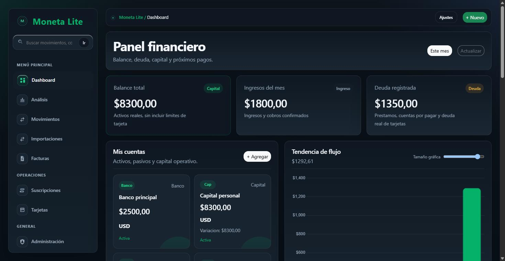
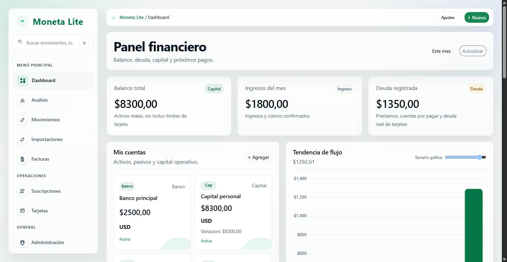
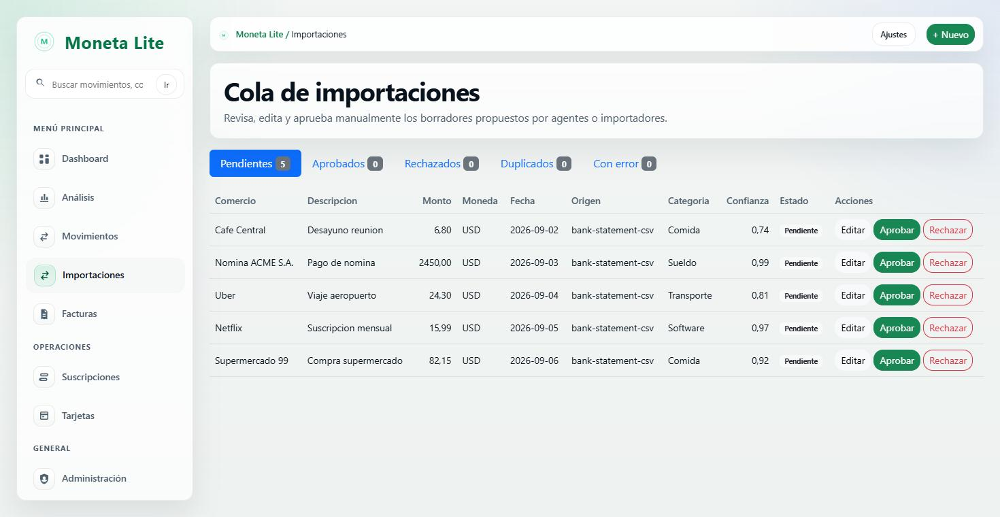
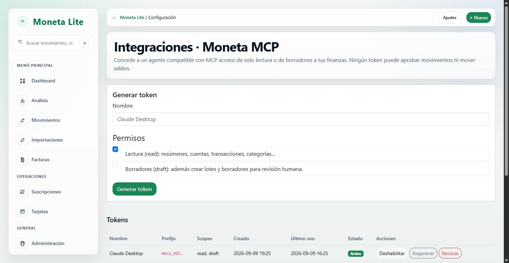
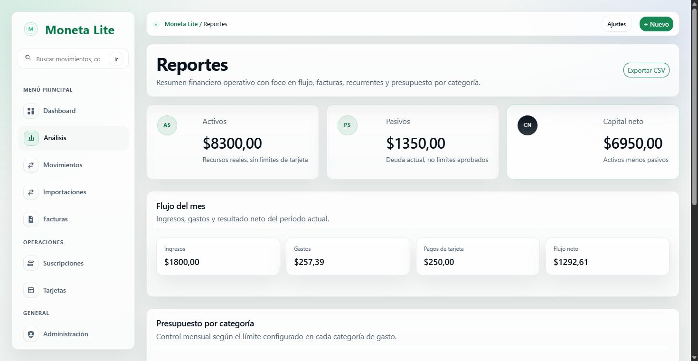

<div align="center">
  

  <h1>Moneta Lite</h1>

  <p><strong>Self-hosted personal finance platform · MCP-ready · privacy-oriented · bilingual (ES/EN) · human-controlled financial automation.</strong></p>

  <p>
    
    
    
    
    
    
    
  </p>

  
</div>

---

**Moneta** es un gestor de finanzas personales *self-hosted*: cuentas, gastos,
facturas, tarjetas, suscripciones, reportes, una **cola de importaciones** con
deduplicación y un **servidor MCP** para agentes de IA. Corre en tu equipo
(Windows, Linux, macOS o NAS), guarda los datos en tu disco y funciona **sin
conexión, sin cuenta en la nube y sin clave de API**.

**Moneta Lite** es la edición **gratuita y de código abierto** (MIT).

```text
✓ Dashboard financiero              ✓ Cola de importaciones con deduplicación
✓ Cuentas y movimientos            ✓ MCP 2026-07-28 — 15 herramientas
✓ Facturas y tarjetas de crédito   ✓ Interoperable con agentes de IA
✓ Suscripciones y seguros          ✓ Aprobación humana obligatoria
✓ Reportes y presupuesto           ✓ SQLite + PostgreSQL
✓ Exportación CSV                  ✓ Español / English · claro / oscuro
```

La IA puede **interpretar**, **sugerir** y **crear borradores**; el núcleo
financiero es **determinista** y **cada movimiento real lo aprueba una persona**.

## Novedades de v0.3.0

- **Cola de importaciones** — `ImportBatch` + `TransactionDraft`, deduplicación
  exacta y por *fingerprint v2*, idempotencia, aprobación y rollback atómicos.
- **Moneta MCP** — protocolo moderno `2026-07-28`, transportes **stdio** y
  **Streamable HTTP oficial**, **10 herramientas `read` + 5 `draft`**.
- **Interoperabilidad con IA** — base `AIProvider` / `DisabledProvider`,
  deshabilitada por defecto; la IA nunca es autoridad financiera.
- **Tokens, scopes y auditoría** — hash HMAC-SHA256, token de un solo uso,
  aislamiento por usuario, rate limiting, registro de auditoría.
- **Flujo de aprobación humana** para todo lo que entra de fuera.
- **Centro de ayuda dentro de la app** (`/ayuda/`) con búsqueda y ayuda
  contextual, en ES/EN.
- **PostgreSQL validado contra una instancia real** (18.6); SQLite sigue siendo
  el modo por defecto.
- Refuerzo de seguridad, mejoras de i18n y de rendimiento, y documentación nueva.

Detalle: [`CHANGELOG.md`](CHANGELOG.md) · [`docs/release-notes/v0.3.0.md`](docs/release-notes/v0.3.0.md)

## Tabla de contenidos

- [Novedades de v0.3.0](#novedades-de-v030)
- [Funcionalidades](#funcionalidades)
- [MONETA en acción](#moneta-en-acción)
- [Inicio rápido (SQLite)](#inicio-rápido-sqlite)
- [Requisitos](#requisitos)
- [Instalación](#instalación)
- [Bases de datos: SQLite y PostgreSQL](#bases-de-datos-sqlite-y-postgresql)
- [Configuración](#configuración)
- [Lite vs Pro](#lite-vs-pro)
- [Cola de importaciones](#cola-de-importaciones)
- [Moneta MCP](#moneta-mcp)
- [Interoperabilidad con IA](#interoperabilidad-con-ia)
- [Ayuda](#ayuda)
- [Seguridad](#seguridad)
- [Idiomas](#idiomas)
- [Self-hosting](#self-hosting)
- [Desarrollo](#desarrollo)
- [Tests](#tests)
- [Documentación](#documentación)
- [Roadmap](#roadmap)
- [Licencia](#licencia)

## Funcionalidades

**Finanzas personales**

- Dashboard financiero — balance, ingresos del mes, deuda, cuentas y tendencia de flujo.
- Cuentas — efectivo, banco, ahorro, inversión, tarjetas, préstamos y capital.
- Movimientos — ingresos, gastos, transferencias, pagos de tarjeta y cobros, con filtros.
- Facturas — emitidas y recibidas, estados y vencimientos.
- Tarjetas de crédito — límite, saldo, disponible, uso %, pago mínimo y de contado, corte y pago.
- Suscripciones y seguros privados (vida, salud, ingreso).
- Reportes — activos, pasivos, capital neto, flujo del mes y presupuesto por categoría.
- Exportación CSV de movimientos, facturas y suscripciones.

**Automatización e inteligencia**

- Cola de importaciones — propuestas de movimientos con deduplicación (*fingerprint v2*).
- Deduplicación exacta por `external_id` y por huella del contenido.
- Moneta MCP — servidor MCP `2026-07-28`, transportes stdio y Streamable HTTP.
- 15 herramientas MCP — 10 de lectura + 5 de borradores.
- Interoperabilidad con agentes de IA, con IA opcional y deshabilitada por defecto.
- Aprobación humana obligatoria para todo lo que entra de fuera.

**Plataforma**

- Self-hosted — tus datos en tu disco, funciona sin conexión.
- SQLite por defecto · PostgreSQL para producción y multiusuario.
- Bilingüe — español (`es-pa`, `es`) e inglés (`en`).
- Tema claro / oscuro / automático.
- Controles de seguridad — aislamiento por usuario, CSRF, rate limiting, auditoría, bloqueo de login.
- Centro de ayuda dentro de la aplicación.

> Moneta Lite **no** incluye pagos recurrentes automáticos, catálogo completo de
> suscripciones, libro contable, ingreso neto ni exportaciones avanzadas. Esos
> módulos están en Moneta Pro — ver [Lite vs Pro](#lite-vs-pro).

## MONETA en acción

<p align="center">
  
  
</p>

<p align="center">
  
  
</p>

_Todas las capturas usan datos de demostración ficticios. Las vistas de movimientos,
tarjetas y suscripciones también están disponibles en [`docs/screenshots/`](docs/screenshots/)._

## Inicio rápido (SQLite)

SQLite es el modo por defecto y no requiere instalar ninguna base de datos.

```bash
# 1. Clonar
git clone https://github.com/kerwilgil/moneta-lite.git
cd moneta-lite

# 2. Entorno virtual
python -m venv .venv
# Windows PowerShell:  .\.venv\Scripts\Activate.ps1
# Windows CMD:         .venv\Scripts\activate.bat
# macOS / Linux:       source .venv/bin/activate

# 3. Dependencias
pip install -r requirements.txt

# 4. Configuración
cp .env.example .env          # Windows: copy .env.example .env
#   edita .env: al menos DJANGO_SECRET_KEY; deja DJANGO_DEBUG=1 para probar en 127.0.0.1

# 5. Base de datos + usuario
python manage.py migrate
python manage.py createsuperuser

# 6. (opcional) Datos de demostración
python manage.py seed_demo    # requiere DJANGO_DEBUG=1

# 7. Arrancar
python manage.py runserver 127.0.0.1:8000
```

Abre <http://127.0.0.1:8000/>.

En Windows también puedes usar `start.bat` / `stop.bat`.

Guía paso a paso para usuarios sin experiencia técnica: [`QUICKSTART.md`](QUICKSTART.md).

## Requisitos

- **Python 3.12, 3.13 o 3.14** (línea Django 6 fijada en `requirements.txt`).
- **SQLite** (por defecto, sin instalar nada) o **PostgreSQL** para producción.
- Dependencias: `Django>=6.0.7,<6.1`, `python-dotenv`, `mcp>=2.2,<3`.
- El frontend usa Bootstrap 5 y Chart.js desde CDN.
- Para el transporte MCP Streamable HTTP: un servidor ASGI (por ejemplo `uvicorn`).

## Instalación

- **Prueba rápida:** [`QUICKSTART.md`](QUICKSTART.md).
- **Instalación completa** (Windows, macOS, Linux, NAS/QNAP, servidor): [`INSTALL.md`](INSTALL.md).

## Bases de datos: SQLite y PostgreSQL

| | SQLite (por defecto) | PostgreSQL (recomendado en producción) |
|---|---|---|
| Instalación | Nada que instalar | Servidor PostgreSQL 14+ y `pip install "psycopg[binary]"` |
| Ideal para | Uso personal, pruebas, un solo usuario | Multiusuario, alta concurrencia, cargas grandes |
| Copia de seguridad | Copiar `db.sqlite3` | `pg_dump` / `pg_restore` |

**Pasar a PostgreSQL:** crea una base y un usuario, define las variables `DB_*`
en tu `.env` (ver `.env.example`) y ejecuta `python manage.py migrate`.

```env
DB_ENGINE=django.db.backends.postgresql
DB_NAME=moneta
DB_USER=moneta
DB_PASSWORD=coloca-una-clave-privada
DB_HOST=127.0.0.1
DB_PORT=5432
```

Moneta v0.3.0 se validó contra **PostgreSQL 18.6** real (migraciones, constraints,
concurrencia con bloqueo de fila, cola de importaciones y MCP). No hay migración
automática de datos entre backends. Guía completa: [`docs/postgresql.md`](docs/postgresql.md).

## Configuración

Crea `.env` a partir de [`.env.example`](.env.example).

| Variable | Descripción | Requerido | Por defecto |
|----------|-------------|-----------|-------------|
| `DJANGO_SECRET_KEY` | Clave privada de Django (50+ caracteres). | Sí | — |
| `DJANGO_DEBUG` | `1` sólo para pruebas locales en `127.0.0.1`; `0` en producción. | — | `0` |
| `DJANGO_ALLOWED_HOSTS` | Dominios/IP permitidos. | En producción | `127.0.0.1,localhost` |
| `DJANGO_CSRF_TRUSTED_ORIGINS` | Orígenes HTTPS de confianza (`https://tu-dominio`). | Si hay proxy/dominio | vacío |
| `DJANGO_SECURE_SSL_REDIRECT` | Forzar HTTPS. | Producción con HTTPS | `1` |
| `SAAS_EDITION` | Edición activa. | — | `lite` |
| `SAAS_APP_NAME` | Nombre visible de la app. | — | `Moneta Lite` |
| `DB_ENGINE` / `DB_NAME` / `DB_USER` / … | Backend de base de datos (ver comentarios en `.env.example` para PostgreSQL). | — | SQLite |
| `MONETA_MCP_TOKEN` | Token para el transporte MCP stdio (no se pasa como argumento CLI). | Sólo MCP stdio | — |

No subas `.env`, `db.sqlite3` ni `logs/` al repositorio (ya están en `.gitignore`).

## Lite vs Pro

La tabla refleja los *feature gates* reales del código (`finanzas/product.py`).

| Módulo | Lite | Pro |
|--------|:----:|:---:|
| Dashboard, cuentas, movimientos | ✅ | ✅ |
| Facturas (emitidas / recibidas) | ✅ | ✅ |
| Tarjetas de crédito | ✅ | ✅ |
| Suscripciones + seguros privados | ✅ | ✅ |
| Reportes y presupuesto por categoría | ✅ | ✅ |
| Exportación CSV básica | ✅ | ✅ |
| Cola de importaciones | ✅ | ✅ |
| Moneta MCP (`read` + `draft`) | ✅ | ✅ |
| Bilingüe ES/EN + modo claro/oscuro | ✅ | ✅ |
| Pagos recurrentes automáticos | — | ✅ |
| Catálogo completo de suscripciones | — | ✅ |
| Libro contable | — | ✅ |
| Ingreso neto (simulación salarial) | — | ✅ |
| Exportaciones avanzadas | — | ✅ |
| Licencia | MIT | Comercial, no redistribuible |

Moneta Pro es la edición de pago con los módulos avanzados. Moneta Lite es
completamente funcional por sí sola.

## Cola de importaciones

Es el único camino por el que un movimiento originado **fuera** de Moneta llega
al núcleo financiero:

```text
Fuente externa → Agente → Moneta MCP → Cola de importaciones
  → Deduplicación → Revisión humana → Aprobación → Núcleo financiero
```

- Deduplicación por `external_id` normalizado y por *fingerprint v2*
  (usuario, origen, comercio, descripción, importe, moneda, fecha, signo).
- Creación de borradores **idempotente**; `raw_metadata` **sanitizada**.
- Aprobación **atómica** con `rollback` completo ante cualquier fallo.
- Estados: `pending`, `approved`, `rejected`, `duplicate`, `error`.
- **MCP no aprueba** — la transición a `approved` sólo ocurre desde la interfaz.

Detalle: [`docs/import-queue.md`](docs/import-queue.md).

## Moneta MCP

Servidor **MCP (Model Context Protocol)** para agentes compatibles.

- Protocolo moderno **`2026-07-28`** (SDK oficial `mcp` 2.2.x); legacy `2025-11-25`.
- Transportes: **stdio** y **Streamable HTTP oficial** (montado en `/mcp`).
- Scopes: **`read`** (10 herramientas) y **`draft`** (5 herramientas).
- **Sin** `approve`, creación directa de movimientos, borrado, mutación de saldos
  ni confirmación de pagos.
- El usuario siempre se deriva del token; no hay override de inquilino.

Genera un token en **Configuración → Integraciones → Moneta MCP**. Se muestra
**una sola vez** y se guarda como HMAC-SHA256 con *pepper*.

```bash
# stdio
MONETA_MCP_TOKEN=<tu-token> python manage.py moneta_mcp_stdio

# Streamable HTTP
uvicorn config.asgi:application --host 127.0.0.1 --port 8001
#   POST http://127.0.0.1:8001/mcp/   con   Authorization: Bearer <tu-token>
```

Detalle y ejemplo de configuración de cliente: [`docs/mcp.md`](docs/mcp.md).

## Interoperabilidad con IA

- La IA puede **interpretar**, **sugerir** y **crear borradores**.
- El **núcleo financiero es determinista**: los saldos y movimientos no dependen
  de la IA.
- **Se requiere aprobación humana** para cualquier movimiento real.
- Moneta funciona **sin IA, sin clave de API y sin internet**. La base de IA
  (`AIProvider` / `DisabledProvider`) viene deshabilitada por defecto; la IA
  nunca es autoridad financiera.

## Ayuda

Moneta incluye un **centro de ayuda dentro de la aplicación** en `/ayuda/`:
índice con búsqueda, un artículo por módulo (qué es, para qué sirve, cómo se usa,
campos, acciones, ejemplo y notas) y ayuda contextual ("? Cómo funciona") en las
pantallas clave. Funciona sin conexión y en español e inglés; la edición Lite no
muestra los módulos Pro.

La referencia completa está en [`docs/user-guide/`](docs/user-guide/).

## Seguridad

- Aislamiento por inquilino en cada consulta (incluido MCP).
- Tokens MCP con hash HMAC-SHA256 + *pepper*; el token en claro no se persiste.
- Modelo de scopes `read` / `draft`; herramientas destructivas ausentes.
- Aprobación humana para entradas externas (Import Queue).
- CSRF en todos los POST; sin efectos de escritura en GET.
- Rate limiting y auditoría de las llamadas MCP, con redacción de secretos.
- Bloqueo de login atómico por cuenta y red.

Antes de exponer una instancia:

```bash
python manage.py test
python manage.py check --deploy
python manage.py secret_scan
python manage.py collectstatic
```

Política y reporte de vulnerabilidades: [`SECURITY.md`](SECURITY.md).

## Idiomas

Interfaz y contenido en `es-pa`, `es` y `en`. El idioma se puede cambiar desde la
propia interfaz. Manual de usuario en [`docs/manual/`](docs/manual/) (ES y EN,
Markdown, HTML y PDF).

## Self-hosting

Moneta corre en PC (Windows/macOS/Linux), NAS o servidor. `runserver` es sólo
para desarrollo local: para acceder desde otra máquina, ponlo detrás de un proxy
inverso con HTTPS o una VPN privada, con `DJANGO_DEBUG=0` y `DJANGO_ALLOWED_HOSTS`
configurado. Ver [`INSTALL.md`](INSTALL.md) (incluye pasos para NAS/QNAP).

## Desarrollo

```bash
python manage.py migrate
python manage.py test
python manage.py check
python manage.py makemigrations --check --dry-run
```

Stack: Django 6 (templates renderizados en servidor), Bootstrap 5, Chart.js,
SQLite/PostgreSQL. Sin build de frontend.

## Tests

```bash
python manage.py test
```

Baseline: **182 tests**, `0 fallos`, `0 errores`, más las suites del centro de ayuda.

| Backend | Resultado |
|---------|-----------|
| SQLite | 182 passed, 6 skipped (2 `exports_advanced` + 4 solo PostgreSQL) |
| PostgreSQL | 182 passed, 2 skipped (`exports_advanced`) |

Para ejecutar contra PostgreSQL, define las variables `DB_*` y vuelve a lanzar
`python manage.py test` (ver [`docs/postgresql.md`](docs/postgresql.md)).

## Documentación

| Documento | Contenido |
|-----------|-----------|
| [`QUICKSTART.md`](QUICKSTART.md) | Prueba rápida en local. |
| [`INSTALL.md`](INSTALL.md) | Instalación completa (Windows, macOS, Linux, NAS). |
| [`docs/user-guide/`](docs/user-guide/) | Guía de usuario completa, un archivo por módulo. |
| [`docs/postgresql.md`](docs/postgresql.md) | Configuración, migración y errores comunes de PostgreSQL. |
| [`docs/mcp.md`](docs/mcp.md) | Servidor Moneta MCP: transportes, scopes, herramientas, ejemplos. |
| [`docs/import-queue.md`](docs/import-queue.md) | Flujo de la cola de importaciones. |
| [`SECURITY.md`](SECURITY.md) | Política de seguridad y postura defensiva. |
| [`FAQ.md`](FAQ.md) | Preguntas frecuentes. |
| [`SUPPORT.md`](SUPPORT.md) | Alcance del soporte. |
| [`CHANGELOG.md`](CHANGELOG.md) · [`docs/release-notes/v0.3.0.md`](docs/release-notes/v0.3.0.md) | Historial de cambios y notas de versión. |
| [`docs/manual/`](docs/manual/) | Manual de usuario en HTML/PDF (ES / EN). |

## Roadmap

- [x] Núcleo financiero determinista, multi-cuenta y multi-moneda.
- [x] i18n ES/EN y modo claro/oscuro.
- [x] Cola de importaciones con deduplicación y aprobación humana.
- [x] Servidor Moneta MCP (`2026-07-28`, stdio + Streamable HTTP).
- [x] Centro de ayuda dentro de la aplicación (ES/EN).
- [x] Integración PostgreSQL validada contra una instancia real (18.6).
- [ ] Publicación de `v0.3.0` (tras la auditoría posterior).

## Licencia

Moneta Lite se distribuye bajo licencia **MIT**. Ver [`LICENSE`](LICENSE).
Puedes usarla, modificarla y redistribuirla conservando el aviso de copyright y
la nota de licencia.
